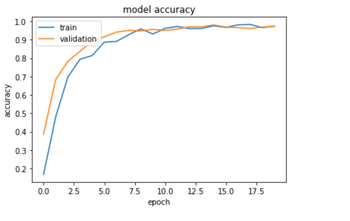
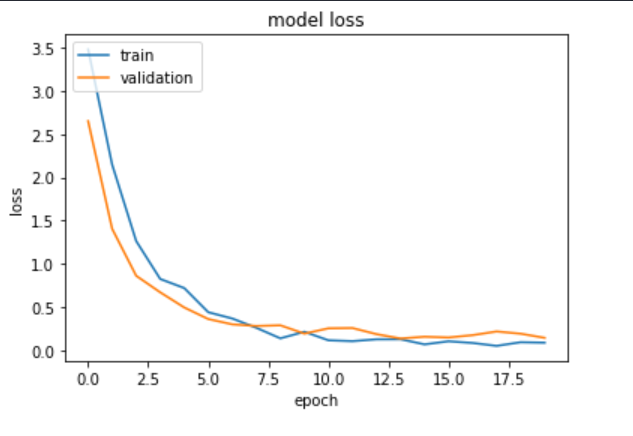
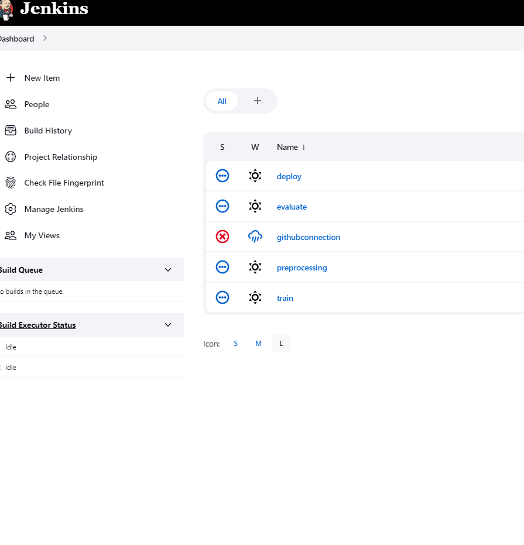

# CNN_Traffic_Sign_Classification

CNN Classification model pipeline code, along with corresponding DockerFile.
Initial experimentation took place in Jupyter notebook, can be seen in Experimentation directory.

After 20 Epochs of training, model accuracy is 97.4%, with a loss of 0.0885. 

ML Pipeline split into 4 steps, Preprocessing, Training, Evaluation, Deployment.
This pipeline is containerised and run through a Jenkins localhost. 

For initial stage, Jenkins pipelins is structured in seperate jobs.

## Jenkins
- First Job defines the connection to the GitHub repo, and triggers whenever a code change is made
- Docker image built from DockerFile
- DockerFile creates local directories for raw data, processed data, metrics, and the model. Then copies files over to container, and installs the dependencies defined in requirements.txt
- Container then run
- Preproessing job runs on completion of first initial job, with code defined in preprocessing.py
- Training job then executed, from code defined in train.py
- Evaluate job then executed, from code defined in evaluate.py
- Deploy job then executed, from code defined in deploy.py

## Preprocesssing 
- Images initially read in through opencv as grayscale
- Then split into test, train, and validation datasets
- Further processing takes place, resizing, normalisation, and image pixel distribution equalisation
- Data then saved into local directory inside docker container, for use in training

## Training
- Training and Validation Data and hyperparameters loaded, and CNN model defined
- Model trained, and saved into local directory.
- Model training metrics pushed to local directory

## Evaluation
- Model loaded, along with test data
- Model evaluated, with evaluation metrics saved to json pushed to local directory

## Deploy
- Flask used to host cnn_model as a REST API endpoint
- Class defined to read in data from request, process, and sent to model for prediction
- Prediction payload returns prediction and confidence value

